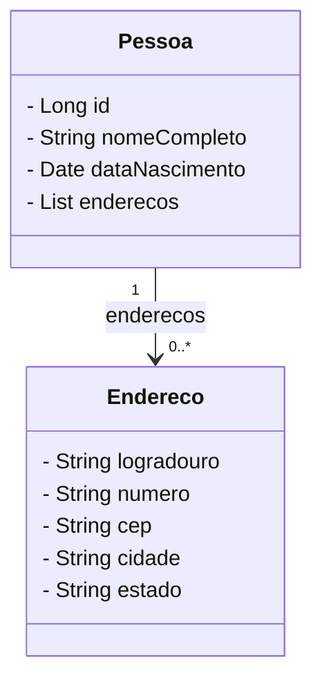

# api-person

Diagrama de Classes sem os métodos

```mermaid
classDiagram
class Pessoa {
- Long id
- String nomeCompleto
- Date dataNascimento
- List<Endereco> enderecos
}

    class Endereco {
        - String logradouro
        - String numero
        - String cep
        - String cidade
        - String estado
    }

    Pessoa "1" --> "0..*" Endereco : enderecos
```